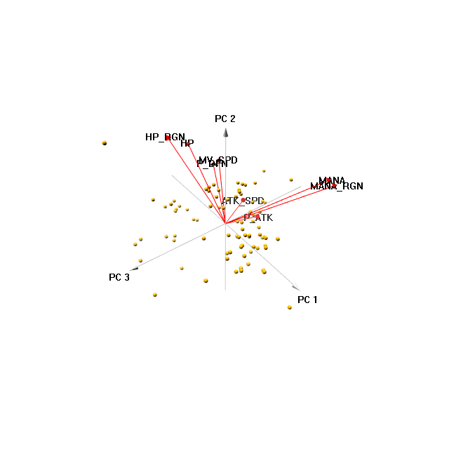

```{r setup, include=FALSE}
knitr::opts_chunk$set(echo = TRUE)
library(robotstxt)
library(tidyverse)
library(ggcorrplot)
library(magrittr)
library(knitr)
library(ggcorrplot)
library(see)
library(latex2exp)
library(car)
library(RColorBrewer) 
library(gtrendsR)
library(GGally)
library(plotly)
library(kableExtra)
library(factoextra)
library(pca3d)
library(Hmisc)
library(ggdendro)
library(dendextend)
library(gridExtra)
```

## Preliminary

Mobile Legends: Bang Bang is a MOBA game (Multiplayer online battle arena) for mobile devices with Android and iOS developed by Shanghai Moonton. The game was originally released in Asia on 11th of June 2016.

In the game there are 2 opposing teams consisting of 5 players each. Players choose a character they will play with before game starts. As for now there are around 90 champions (character) to choose from. Each character is different and may be used for different purposes depending on their skills and abillities. In that way one can distinguish mages, assasins and some more types of champions. Main task is to destroy enemies' defence towers resulting in concquering their base (yup, it's very boring but somehow very popular).

The game was getting more and more attention in Poland for a couple of years now. The graph below presents interest over time for google query "Mobile Legends" and "MOBA" in Poland. As you can see around 2017 there was a hugh increase in popularity of the game while interest in MOBA games in general was falling down gradually in past 5 years. However in March and April 2020 they experienced a rapid renaissance. We can probably associate it with a lockdown caused by COVID-19 outbreak.


```{r, echo = FALSE, message = FALSE}
results <- gtrends(c("mobile legends", "MOBA"), geo = "PL", time = "2015-01-01 2020-04-04")

res_time <- results$interest_over_time 
```

```{r, echo = FALSE, message = FALSE}
res_plot <- ggplot(res_time,aes(x = date, y = hits, col = keyword)) +
  geom_line()+
  scale_color_manual(values=c("darkred", "steelblue"))+
  ggtitle("Interest in 'Mobile Legends' and 'MOBA' in Google (Poland)") +
  theme_classic()+
  theme(legend.position = "none")
 

ggplotly(res_plot, dynamicTicks = TRUE, height = 600, width = 850) %>%
  rangeslider() %>%
  layout(hovermode = "x")
```


As stated above there are several types of characters in that game so we will try to label them based on their characteristics. In order to do so we are going to implement Principal Component Analysis to reduce dimentionallity and then k-means method to cluster them. Although the labels are known such an analysis may be helpful for maintaining characters' skill sets in a balance way.

## Data 

First we have to collect the data. As there is no official site with the data on champions characteristics we will scrape it from [mobile league wiki site](https://mobile-legends.fandom.com/wiki/Mobile_Legends_Wiki). Let's check *robot.txt* file before we start.

```{r, warning=F}
paths_allowed("https://mobile-legends.fandom.com/wiki/Mobile_Legends_Wiki")
```

That's nice - we are allowed to scrape their data. For that purpose we will combine `rvest` package and [selector gadget](https://selectorgadget.com/). Below you can find a brief overview on how to scrape the data.
Whole scraping/wrangling code is provided in a speparate Rmd file in gitHub repository.

Let's have a look on how our data looks like. In the table below you can find all characters in alphabetical order. 

One important remark is although the list below present all playable characters right now we are going to consider it as sample since the characters' set is being constantly updated with new characters - in that way statistical inference can be justified.

```{r, echo = FALSE}
load("scraped_skills_data.Rda")
  
var.labels = c(Id = "Id", HERO="Hero", MV_SPD="Movement speed",
               MGC_DFN = "Magic Resistance", MANA = "Mana",
               HP_RGN = "HP Regen Rate", P_ATK = "Physical Attack",
               P_DFN = "Armor", HP = "Health points", 
               ATK_SPD = "Attack speed", MANA_RGN = "Mana regen rate",
               ROLE = "Role", SPECIALLY = "Special")

Hmisc::label(df) = as.list(var.labels[match(names(df), names(var.labels))])


kable(df, col.names = Hmisc::label(df)) %>% 
  kable_styling(fixed_thead = T, font_size = 10.75) %>%
  kable_styling(bootstrap_options = c("striped", "hover", "condensed", "responsive"))
```

One important thing we should be interested in is the variability of champions characteristics. Below you can see the coefficient of variation (in %).

```{r, echo = F}
cv <- function(x){
  round((sd(x, na.rm = TRUE)/mean(x, na.rm  = TRUE))*100,2)
}

df %>%
  mutate(Id = as.character(Id))%>%
  summarize_if(is.numeric, cv) %>%
  kable(col.names = Hmisc::label(df)[-c(1,2,12,13)]) %>%
  kable_styling(font_size = 12)
```

The variabiliy of *mana* and *mana regeneration* exeeds 50% whereas for *health points regeneration* and *armor* it's about 20%. We will have to check the data for outliers as those values might be inflated for instance just by a single observation. Rest of the variables vary just a bit (under 10%). The value for magic resistance is constant for every character so we are going to drop that variable in further analysis.


Now let's look for some possible relationships and check distributions of the variables.

```{r, message= F, warning=F, echo = F}
df %<>% mutate(HP = HP/1000)
  

p <- ggpairs(data=df, columns=3:10, 
             lower = list(continuous = wrap("points",alpha = 0.5, size=0.5, col = "steelblue")),
  diag = list(continuous = wrap("densityDiag", fill = "darkred", alpha = 0.8)))+
  theme_classic()

ggplotly(p, height = 800, width = 850)
```


We can see some relationships - f.e. *mana* vs. *mana regeneration* and *health points* vs. *armor* and many more - we are going to investigate them soon. 

There are some outliers - note a champion whose *health point regeneration* ability is almost 3 times more powerful than the mean for the sample. We can also see a champion whose *health points* ability is about 2 times weaker than the average. Let's find out who are those people.

```{r, echo = FALSE }
df[c(which.max(df$ATK_SPD), which.min(df$HP)), ] %>%
  kable(col.names = Hmisc::label(df)) %>%
  kable_styling(font_size = 11)
```


```{r, echo = FALSE, out.width= "65%", out.extra='style="float:right; padding:10px"'}
df_num <- df[,-c(1,2,11,12)] %>%
  drop_na()%>%
  as.data.frame()

#rownames(df_num) <- df$HERO
df_num<- df_num[-c(which.max(df$HP_RGN), which.min(df$HP)), ]
correlations <- cor(df_num)
p_mat <- cor_pmat(df_num)

ggcorrplot(correlations, hc.order = TRUE, type = "lower", lab = TRUE, digits = 1,
           p.mat = p_mat, ggtheme = ggplot2::theme_classic, sig.level = 0.001,
           colors = c("steelblue", "white", "darkred"),
           title = "Pearson's correlation matrix", legend.title = latex2exp :: TeX("$\\rho$ value"),)


```

For the sake of analysis we are going to remove both of them from our "sample".

Density functions for variables like movement speed, mana and mana regenerations seem to be bimodal - it is clear sign there are some subpopulations in our "sample" so it is reasonable to conduct cluster analysis.


We can check the correlations and their significance - just for fun since [Simson paradox](https://en.wikipedia.org/wiki/Simpson%27s_paradox) might be present. 


## Principal Compontent Analysis

Firstly let's calculate prinipal components using standarized data. 

```{r, echo = FALSE, warning = FALSE}
pca <- prcomp(df_num, scale = TRUE)
```


As scree plot would not tell us much we should choose the number of compontents based on eigenvalue thumb rule. Each of three top components has eigenvalue > 1, i.e. "contains more information than a single variable". 


```{r, echo = FALSE}
eig.tab <- data.frame(rownames(get_eigenvalue(pca)), round(get_eigenvalue(pca),2))

colnames(eig.tab) <- c("PCA", "Eigenvalue", "Variance percent", "Cumulative variance percent")

rownames(eig.tab) <- paste0("PC",1:8)
  
eig.tab[,-1] %>%
  kable()%>%
  kable_styling() %>%
  row_spec(1:4, bold = T, color = "white", background = "darkred")
```

As you can see in the table above they account for about 75,6% of data variability - that's fine. However in order to make interpretations of the components easier we are going to incorporate 4 of them in our further analysis. In that way almost 85,5% of the variance will be explained.

Let's have a look now on the PCA loadings so we can think of some resonable interpretations.

```{r, echo = FALSE}
pca.lo <- data.frame(rownames(pca$rotation), round(pca$rotation,3))
colnames(pca.lo)[1] <- "Variable"

pca.lo%>%
  mutate_if(is.numeric, function(x) {
    cell_spec(x, bold = T, 
              color = spec_color(x, end = 0.5),
              font_size = spec_font_size(abs(x)))
  })%>%
  mutate(Variable = cell_spec(
    Variable, color = "white", bold = T,
    background = spec_color(1:8, end = 0.9, option = "C", direction = -1)
  )) %>%
  kable(escape = F, align = "c") %>%
  kable_styling(c("striped", "condensed"), full_width = F, position = "float_right")

```

The most obvious interpretation has definitely PC2. We can think of it as `durability` of a character because the loadings' values by *health points* and *health points regeneration* are large and influence PC in one direction.

Next quite resonable interpretation would be `physical strength` for PC4 because of extend of *attack points* influence and also becasue of the opposite sign of *armor* variable.

`Readiness to fight` would be the label for PC3. Since both signs of loadings by variable *mana* and *mana regeneration* are strongly negative, we would expect all magical champions to have very low value of PC3. 

As we cannot came up with anything better for PC1 let's call it for now `playability` and later on maybe we will be able to review that issue.

If we would include PC5 we would probably call it `defensive capability`. For more precise labeling we should talk to some gamers with experience and knowledge about the game - maybe someday i will upload it with my recent dicoveries :)

```{r, echo = FALSE}
#pca3d(pca, biplot = TRUE)
#snapshotPCA3d(file="first_plot.png")
#
```


```{r, include=FALSE, echo=FALSE}
#Obtaining pca scores for our observation
df_pca <- get_pca_ind(pca)
df_pca <- df_pca$coord[, 1:4]
```


## Clusters

Now as we reduced dimentionality we can proceed to the most exciting part of our analysis - clusters distinguishment. To do so we will implement hierarchical algorithm. First let's start with computing distances between observation. For that purpose we will use first and second order of Minkowski metrics, i.e. Mannhatan and Euclidean distances responsively.


```{r, echo =FALSE}
rownames(df_pca)  <- rownames(df_num)
distance.e <- get_dist(df_pca, method = "euclidean")
distance.m <- get_dist(df_pca, method = "manhattan")

dist.e.plot <- fviz_dist(distance.e, gradient = list(low = "steelblue", mid = "white", high = "darkred"), lab_size = 4)

dist.m.plot <- fviz_dist(distance.m, gradient = list(low = "steelblue", mid = "white", high = "darkred"), lab_size = 4)

grid.arrange(dist.e.plot, dist.m.plot)

```


```{r}
#hc <- hclust(d.e, method = "ward.D2")
```
